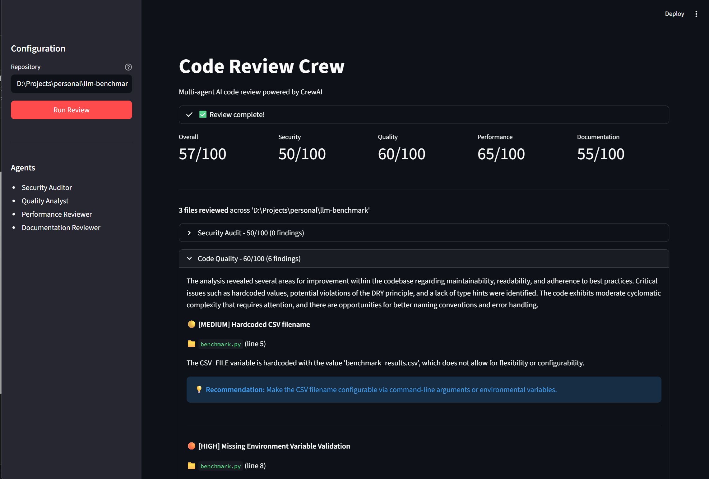

# Portfolio: Code Review Crew

Multi-agent AI code review system built with CrewAI. Four specialised agents collaboratively analyse codebases and produce consolidated review reports with actionable findings.



## Agents

| Agent | Focus |
|-------|-------|
| 🛡️ Security Auditor | Hardcoded secrets, injection risks, vulnerable dependencies (via pip-audit + OSV) |
| 📐 Code Quality Analyst | Complexity metrics (AST analysis), DRY violations, naming, type hints |
| ⚡ Performance Reviewer | Inefficient algorithms, blocking I/O, memory patterns, N+1 queries |
| 📝 Documentation Reviewer | Docstring coverage, README accuracy, inline comments, API docs |

## Features

- **Multi-agent orchestration** — sequential CrewAI pipeline with shared memory
- **Structured output** — Pydantic models with severity-rated findings
- **Dual input** — accepts GitHub URLs (auto-clones) or local file paths
- **Custom tools** — AST analyser for objective metrics, pip-audit for real CVE data
- **Dual LLM support** — OpenAI or local Ollama inference
- **Streamlit UI** — score cards, expandable findings, JSON export
- **CLI mode** — headless execution with JSON output

## Example Output
See [examples/sample_review_report.json](examples/sample_review_report.json) for a sample review report.

## Quick Start

```bash
git clone https://github.com/benwalkerai/Portfolio_CodeReviewCrew.git
cd Portfolio_CodeReviewCrew
cp .env.example .env
# Edit .env with your API key
uv sync
```

### Streamlit UI

```bash
uv run streamlit run src/ui/interface.py
```

### CLI

```bash
uv run python main.py /path/to/repo -o report.json
uv run python main.py https://github.com/user/repo -o report.json
```

### Docker

```bash
docker build -t code-review-crew .
docker run -p 8501:8501 --env-file .env code-review-crew
```

## Configuration

| Variable | Default | Description |
|----------|---------|-------------|
| `LLM_PROVIDER` | `openai` | `openai` or `ollama` |
| `OPENAI_API_KEY` | — | Required if using OpenAI |
| `MODEL_NAME` | `gpt-4o-mini` | Model to use |
| `OLLAMA_BASE_URL` | `http://localhost:11434` | Ollama endpoint |
| `VERBOSE` | `true` | Agent verbose logging |

## Project Structure

```
Portfolio_CodeReviewCrew/
├── src/
│   ├── agents/           # Agent definitions (4 specialists)
│   ├── tasks/            # Task definitions per agent
│   ├── tools/            # Custom CrewAI tools
│   │   ├── file_reader.py
│   │   ├── ast_analyser.py
│   │   ├── dependency_checker.py
│   │   └── repo_loader.py
│   ├── ui/               # Streamlit interface
│   ├── config.py         # LLM provider configuration
│   ├── models.py         # Pydantic output schemas
│   └── crew.py           # Crew orchestration
│   ├── tests/            # Unit tests
├── main.py               # CLI entry point
├── Dockerfile
└── pyproject.toml
```

## Tech Stack

Python, CrewAI, Streamlit, Pydantic, pip-audit, AST module

## License

MIT

**Version**: 1.0.0  
**Author**: [Ben Walker](https://github.com/benwalkerai)
